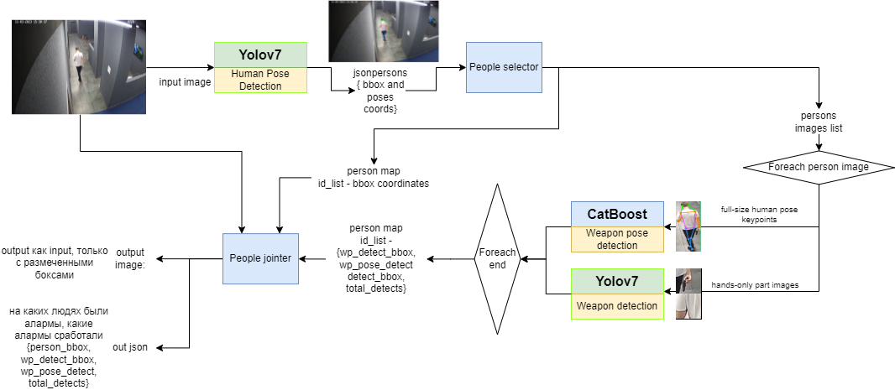
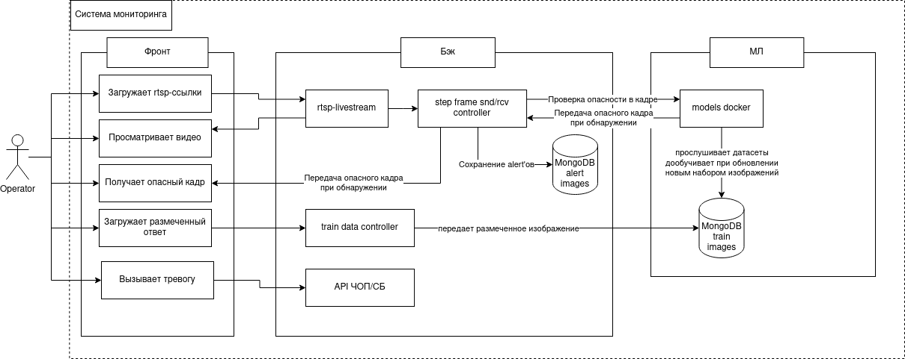
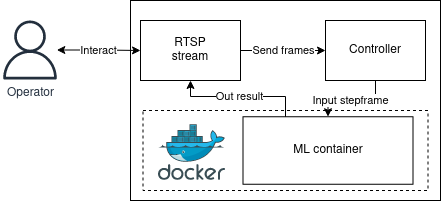
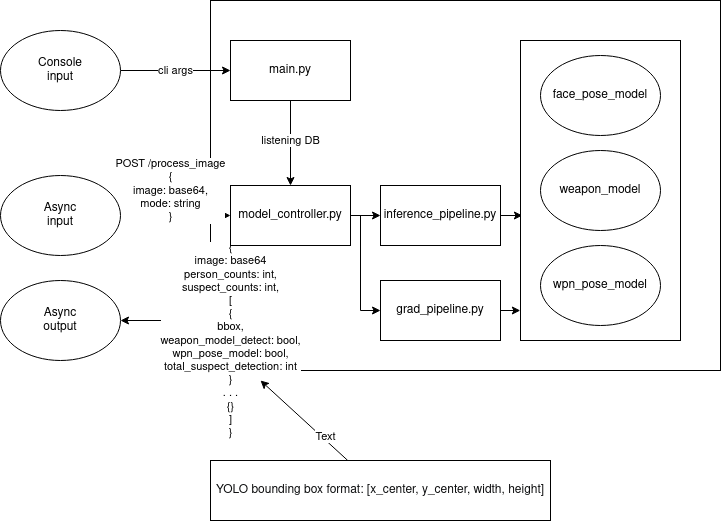
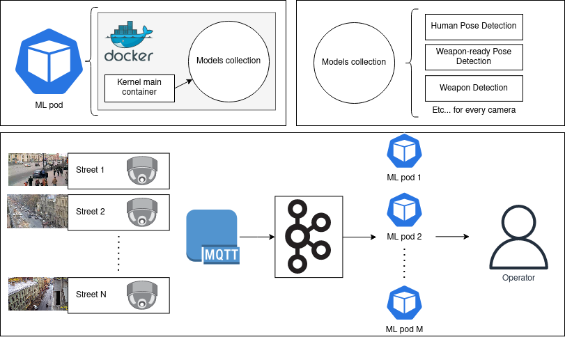
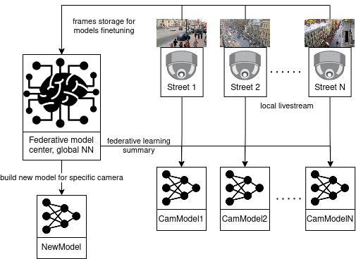

<!-- TODO: перевод с русского на английский -->
# Description
Project for detecting weapons and other suspicious objects through network cameras.

## Team members
- Alexandr Zhdanov, 4 course, Team Leader, ML
- Artem Darius-Veber, 2 course, ML
- Anton Zhuravlev, 3 course, Full-stack
- Anastasiya Sergeeva, 4 course, Designer
- Daler Homidov, 3 course, PM, Speaker

# Research
## Proposal, by abstract
Our solution, вкратце:
- YOLOv7 pose для детекции людей
- Изображение каждого обнаруженного человека и его составных частей тела (по keypoint'ам) проходит в модель
- Любое обнаружениие по бинарной классификации формирует стимул
- Если сумма стимулов преодолевает порог, то вызываем оператора на проверку
- Также в рамках отладки можно рассматривать любое обнаружение как спектр: от минимальных подозрений, до полной тревоги
    - Это позволит проводить оператором диагностику модели или увеличивать строгость работы системы, к примеру, для обслуживания аэропортов

<!-- after MVP -->
<!-- Для подробностей см. исследование по теме -->
<!--  -->

# Project Features
- [x] Обработка моделью RTSP поток
- [x] Обработка моделью видео
- [x] Просмотр видео и RTSP оператором
- [x] Оценка угрозы оператором в категории "События"
- [x] Отправление размеченных изображений оператором в датасет для дообучения

# User-story

# MVP Project structure
## Architecture

## ML pipeline

# Release Project plan
## Architecture

## ML Federative learning

<!-- # Run
## Native
### ML
after MVP -->
<!-- python main.py -->

<!-- ## Docker
### Build
after MVP -->
<!-- docker build -->

<!-- ### Run
after MVP -->
<!-- docker run -->

<!-- # Using datasets -->
<!-- TODO: -->

<!-- # Weights, link
after MVP -->
<!-- TODO: -->

<!-- # Acknowledge -->
